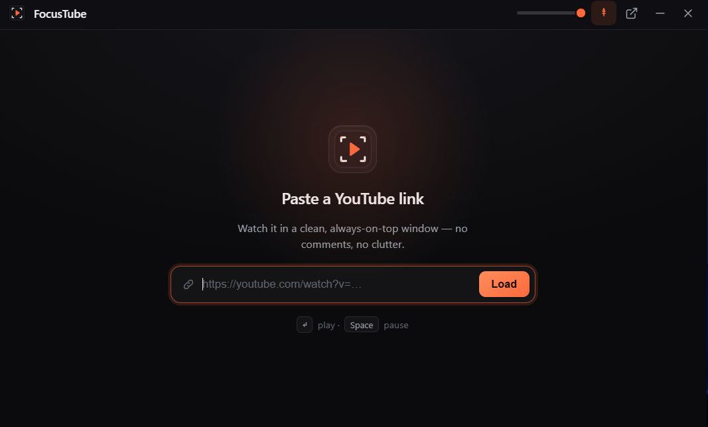

<div align="center">


# FocusTube

**YouTube — without the noise.**

A borderless, always-on-top desktop video player built for people who work and watch at the same time.

<br/>

[](https://github.com/anwar-elbarry/focustube/releases/latest)
[](LICENSE)
[](https://v2.tauri.app)
[](https://www.rust-lang.org)

<br/>



</div>

---

## ✨ Why FocusTube?

> You open YouTube to watch one tutorial. Fifteen minutes later you're deep in the recommendations rabbit hole, reading comments, and have completely forgotten what you were doing.

**FocusTube fixes that.**

Paste a link → get a clean, floating video player with zero distractions. It floats above your work. You stay in the zone.

---

## 🚀 Features

| | Feature | Details |
|---|---|---|
| 📌 | **Always on Top** | Floats above every window — VSCode, Figma, terminal, anything |
| 🧼 | **Zero Clutter** | No sidebar, no comments, no ads, no recommended videos |
| 🌫️ | **Adjustable Opacity** | Drag the slider — the player becomes semi-transparent so you can see your work through it |
| ⌨️ | **Global Play/Pause** | Hit `Space` or your media key even when FocusTube isn't focused |
| 🔗 | **Any YouTube URL** | Works with `youtube.com/watch`, `youtu.be`, and Shorts links |
| 🔒 | **No Account Needed** | Paste and play. No sign-in, no tracking, no cookies |
| 🪶 | **Tiny Footprint** | Under 10 MB installer. Launches in under a second |

---

## ⚡ Get Started in 3 Steps

```
1.  Download  →  Grab the installer for your OS from the Releases page
2.  Paste     →  Drop any YouTube link into FocusTube
3.  Float     →  Your video plays in a clean window above everything else
```

[](https://github.com/anwar-elbarry/focustube/releases/latest)
[](https://github.com/anwar-elbarry/focustube/releases/latest)
[](https://github.com/anwar-elbarry/focustube/releases/latest)

---

## 🛠️ Tech Stack

```
┌─────────────────────────────────────────────────────┐
│                     FocusTube                       │
├──────────────┬──────────────────────────────────────┤
│  Shell       │  Tauri v2  (Rust)                    │
│  Frontend    │  React 18 + TypeScript                │
│  Bundler     │  Vite                                 │
│  Video       │  YouTube IFrame API                   │
│  Styling     │  Vanilla CSS                          │
└──────────────┴──────────────────────────────────────┘
```

---

## 🧑‍💻 Build from Source

### Prerequisites

Make sure you have the following installed:

- [Node.js](https://nodejs.org) LTS
- [Rust](https://rustup.rs) (stable toolchain)
- WebView2 — preinstalled on Windows 10 / 11
- Visual Studio Build Tools with **"Desktop development with C++"** workload

> Full setup guide: [Tauri v2 Prerequisites](https://v2.tauri.app/start/prerequisites/)

### Commands

```bash
# Install dependencies
npm install

# Start development mode (hot reload)
npm run tauri dev

# Build production installer
npm run tauri build
```

---

## 📁 Project Structure

```
focustube/
├── index.html              # App entry point
├── src/                    # React frontend
│   ├── App.tsx             # Main app shell + controls
│   ├── Player.tsx          # YouTube IFrame player wrapper
│   ├── youtube.ts          # URL parser (watch / youtu.be / shorts)
│   └── styles.css          # All app styles
├── src-tauri/              # Rust + Tauri backend
│   ├── tauri.conf.json     # Window config, permissions
│   ├── src/lib.rs          # Plugin registration
│   └── icons/              # App icons (all sizes)
└── docs/                   # Marketing landing page (GitHub Pages)
    ├── index.html
    ├── styles.css
    └── script.js
```

---

## 🗺️ Roadmap

- [ ] Click-through / full transparency mode
- [ ] Multi-tile grid — watch 2–3 videos side by side
- [ ] Audio-only mode + playback speed presets
- [ ] Timestamp notes & personal playlists
- [ ] Picture-in-picture snap zones

---

## 🌐 Website

👉 **[focustube-puce.vercel.app](https://focustube-puce.vercel.app)**

---

<div align="center">

Made with ❤️ by **[Anouar El Barry](https://elbarry.me)**

*If FocusTube helped you stay focused, consider giving it a ⭐ on GitHub!*

</div>
